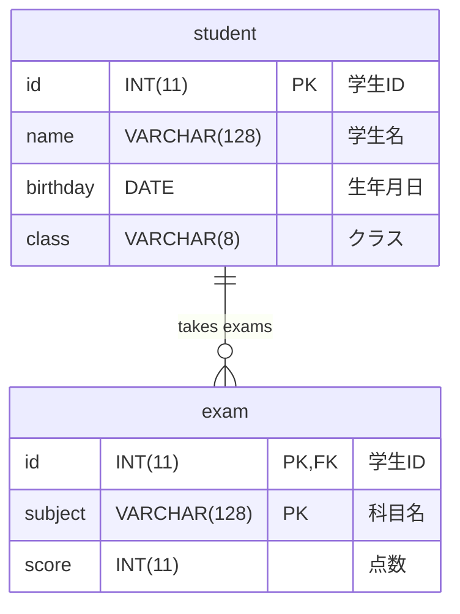

# School データベーススキーマ

## テーブル構造とリレーション



## テーブル詳細

### 1. student テーブル

- **id** (INT(11), PRIMARY KEY): 学生 ID
- **name** (VARCHAR(128)): 学生名
- **birthday** (DATE): 生年月日
- **class** (VARCHAR(8)): 所属クラス（NULL 可）

### 2. exam テーブル

- **id** (INT(11), PRIMARY KEY, FOREIGN KEY): 学生 ID（student.id を参照）
- **subject** (VARCHAR(128), PRIMARY KEY): 科目名
- **score** (INT(11)): 試験の点数

## リレーション

### student ↔ exam

- **関係**: 1 対多の関係（1 人の学生が複数の科目を受験）
- **結合条件**: `student.id = exam.id`
- **説明**: 各学生は複数の科目で試験を受け、各試験レコードは特定の学生に属する
- **制約**: exam.id は NOT NULL（必ず学生に紐づく）

### 複合主キー

- **exam テーブル**: `(id, subject)` の組み合わせが主キー
- **説明**: 同じ学生が同じ科目を複数回受験することはない

## 実際のデータ

### student テーブルのデータ

```sql
INSERT INTO student VALUES
(1,'佐藤 琢磨','1977-01-28','CG'),
(2,'大塚 愛','1982-09-09','Web'),
(3,'藤井 隆','1972-03-10','Web'),
(4,'福原 愛','1988-11-01','CG'),
(5,'大黒 将志','1980-05-04',NULL);
```

### exam テーブルのデータ

```sql
INSERT INTO exam VALUES
(1,'PC基礎',92),(1,'デザイン',77),
(2,'PC基礎',51),(2,'デザイン',80),
(3,'デザイン',74),
(4,'PC基礎',85),(4,'デザイン',64);
```

## 相関副問い合わせの解析

### クエリ例

```sql
SELECT * FROM exam AS t1
WHERE score = (SELECT MAX(score) FROM exam AS t2 WHERE t1.subject = t2.subject)
```

### 処理の詳細解析

#### 1. データの状況

現在の exam テーブルのデータから科目別最高点：

- **PC 基礎**: 最高点 92 点（学生 ID: 1）
- **デザイン**: 最高点 80 点（学生 ID: 2）

#### 2. 相関副問い合わせの実行過程

| 処理順 | 外部クエリの行     | 内部クエリの実行   | 条件判定 | 結果   |
| ------ | ------------------ | ------------------ | -------- | ------ |
| 1      | id=1, PC 基礎, 92  | MAX(PC 基礎) = 92  | 92 = 92? | ✓ 選択 |
| 2      | id=1, デザイン, 77 | MAX(デザイン) = 80 | 77 = 80? | ✗ 除外 |
| 3      | id=2, PC 基礎, 51  | MAX(PC 基礎) = 92  | 51 = 92? | ✗ 除外 |
| 4      | id=2, デザイン, 80 | MAX(デザイン) = 80 | 80 = 80? | ✓ 選択 |
| 5      | id=3, デザイン, 74 | MAX(デザイン) = 80 | 74 = 80? | ✗ 除外 |
| 6      | id=4, PC 基礎, 85  | MAX(PC 基礎) = 92  | 85 = 92? | ✗ 除外 |
| 7      | id=4, デザイン, 64 | MAX(デザイン) = 80 | 64 = 80? | ✗ 除外 |

#### 3. 最終結果

```markdown
| id  | subject  | score |
| --- | -------- | ----- |
| 1   | PC 基礎  | 92    |
| 2   | デザイン | 80    |
```

### パフォーマンス分析

- **内部クエリ実行回数**: 7 回（exam テーブルの行数分）
- **各内部クエリ**: 科目でフィルタリングして MAX 関数を実行
- **改善案**: subject にインデックスを作成することで高速化可能

### 代替クエリ（WINDOW 関数使用）

```sql
SELECT id, subject, score
FROM (
    SELECT id, subject, score,
           MAX(score) OVER (PARTITION BY subject) as max_score
    FROM exam
) t
WHERE score = max_score;
```

## データ型の説明

### 文字列型

- **VARCHAR(128)**: 可変長文字列（学生名、科目名）
- **VARCHAR(8)**: 可変長文字列（クラス名）

### 数値型

- **INT(11)**: 整数型（学生 ID、点数）

### 日付型

- **DATE**: 日付型（生年月日）

## インデックス情報

### 主キー

- **student**: id
- **exam**: (id, subject)

### 外部キー

- **exam.id** → student.id

### 推奨インデックス

- **exam.subject**: 科目別検索・集計の高速化
- **exam.score**: 点数順ソートの高速化
- **student.class**: クラス別検索の高速化
