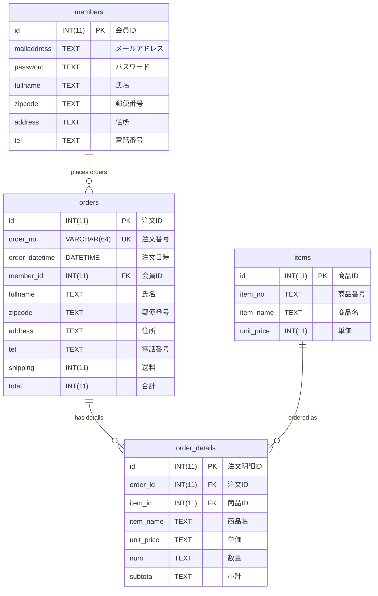

# Seabreeze データベーススキーマ

## テーブル構造とリレーション

## テーブル詳細

### 1. members テーブル（会員マスタ）

- **id** (INT(11), PRIMARY KEY, AUTO_INCREMENT): 会員 ID
- **mailaddress** (TEXT, NOT NULL): メールアドレス
- **password** (TEXT, NOT NULL): パスワード
- **fullname** (TEXT): 氏名
- **zipcode** (TEXT): 郵便番号
- **address** (TEXT): 住所
- **tel** (TEXT): 電話番号

### 2. items テーブル（商品マスタ）

- **id** (INT(11), PRIMARY KEY, AUTO_INCREMENT): 商品 ID
- **item_no** (TEXT, NOT NULL): 商品番号
- **item_name** (TEXT, NOT NULL): 商品名
- **unit_price** (INT(11), NOT NULL): 単価

### 3. orders テーブル（注文テーブル）

- **id** (INT(11), PRIMARY KEY, AUTO_INCREMENT): 注文 ID
- **order_no** (VARCHAR(64), UNIQUE KEY, NOT NULL): 注文番号
- **order_datetime** (DATETIME, NOT NULL): 注文日時
- **member_id** (INT(11), FOREIGN KEY, NOT NULL): 会員 ID（members.id を参照）
- **fullname** (TEXT, NOT NULL): 氏名
- **zipcode** (TEXT, NOT NULL): 郵便番号
- **address** (TEXT, NOT NULL): 住所
- **tel** (TEXT, NOT NULL): 電話番号
- **shipping** (INT(11), NOT NULL): 送料
- **total** (INT(11), NOT NULL): 合計

### 4. order_details テーブル（注文明細テーブル）

- **id** (INT(11), PRIMARY KEY, AUTO_INCREMENT): 注文明細 ID
- **order_id** (INT(11), FOREIGN KEY, NOT NULL): 注文 ID（orders.id を参照）
- **item_id** (INT(11), FOREIGN KEY, NOT NULL): 商品 ID（items.id を参照）
- **item_name** (TEXT, NOT NULL): 商品名
- **unit_price** (TEXT, NOT NULL): 単価
- **num** (TEXT, NOT NULL): 数量
- **subtotal** (TEXT, NOT NULL): 小計

## リレーション

### 1. members ↔ orders

- **関係**: 1 対多の関係（1 人の会員が複数の注文）
- **結合条件**: `members.id = orders.member_id`
- **説明**: 各注文は必ず 1 人の会員に属し、1 人の会員は複数の注文を行うことができる
- **制約**: orders.member_id は NOT NULL

### 2. orders ↔ order_details

- **関係**: 1 対多の関係（1 つの注文に複数の注文明細）
- **結合条件**: `orders.id = order_details.order_id`
- **説明**: 各注文明細は必ず 1 つの注文に属し、1 つの注文には複数の商品明細が存在する
- **制約**: order_details.order_id は NOT NULL

### 3. items ↔ order_details

- **関係**: 1 対多の関係（1 つの商品が複数の注文明細）
- **結合条件**: `items.id = order_details.item_id`
- **説明**: 各注文明細は必ず 1 つの商品を参照し、1 つの商品は複数の注文明細で使用される
- **制約**: order_details.item_id は NOT NULL

## ビュー

### members_order ビュー

会員の注文情報を集計したビュー。以下の情報を含む：

- **id**: 会員 ID
- **fullname**: 氏名
- **mailaddress**: メールアドレス
- **address**: 住所
- **order_total**: 注文合計金額
- **order_count**: 注文回数
- **item_count**: 購入商品数
- **latest_order_datetime**: 最新注文日時

## インデックス情報

### 主キー

- **members**: id
- **items**: id
- **orders**: id
- **order_details**: id

### ユニークキー

- **orders**: order_no

### 外部キー

- **orders.member_id** → members.id
- **order_details.order_id** → orders.id
- **order_details.item_id** → items.id

### 推奨インデックス

- **orders.member_id**: 会員別注文検索の高速化
- **orders.order_datetime**: 日時順ソートの高速化
- **order_details.order_id**: 注文別明細検索の高速化
- **order_details.item_id**: 商品別売上検索の高速化
