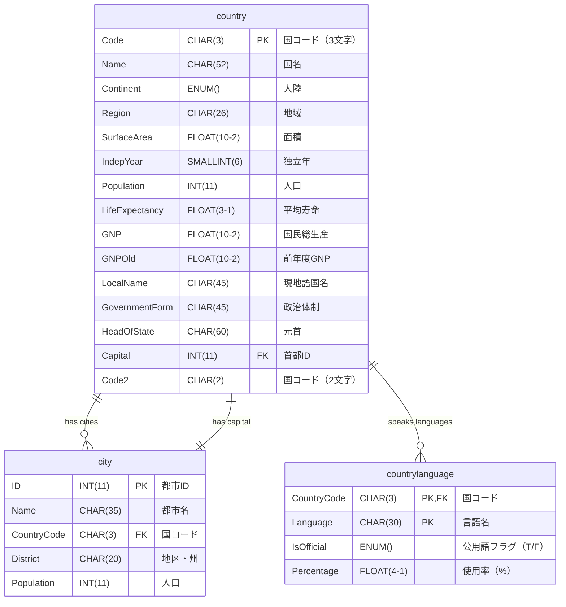

# World データベーススキーマ

## テーブル構造とリレーション

## テーブル詳細

### 1. country テーブル

- **Code** (CHAR(3), PRIMARY KEY): 国コード（ISO 3166-1 alpha-3）
- **Name** (CHAR(52)): 国名
- **Continent** (ENUM('Asia','Europe','North America','Africa','Oceania','Antarctica','South America')): 大陸
- **Region** (CHAR(26)): 地域名
- **SurfaceArea** (FLOAT(10,2)): 面積（平方キロメートル）
- **IndepYear** (SMALLINT(6)): 独立年（NULL 可）
- **Population** (INT(11)): 人口
- **LifeExpectancy** (FLOAT(3,1)): 平均寿命（NULL 可）
- **GNP** (FLOAT(10,2)): 国民総生産（NULL 可）
- **GNPOld** (FLOAT(10,2)): 前年度 GNP（NULL 可）
- **LocalName** (CHAR(45)): 現地語での国名
- **GovernmentForm** (CHAR(45)): 政治体制
- **HeadOfState** (CHAR(60)): 元首（NULL 可）
- **Capital** (INT(11), FOREIGN KEY): 首都の city.ID を参照（NULL 可）
- **Code2** (CHAR(2)): 国コード（ISO 3166-1 alpha-2）

### 2. city テーブル

- **ID** (INT(11), PRIMARY KEY): 都市 ID（自動増分）
- **Name** (CHAR(35)): 都市名
- **CountryCode** (CHAR(3), FOREIGN KEY): country.Code を参照
- **District** (CHAR(20)): 地区・州名
- **Population** (INT(11)): 人口

### 3. countrylanguage テーブル

- **CountryCode** (CHAR(3), PRIMARY KEY, FOREIGN KEY): country.Code を参照
- **Language** (CHAR(30), PRIMARY KEY): 言語名
- **IsOfficial** (ENUM('T','F')): 公用語フラグ（'T'=公用語, 'F'=非公用語）
- **Percentage** (FLOAT(4,1)): その国での使用率（%）

## リレーション

### 1. country ↔ city (都市関係)

- **関係**: 1 対多の関係（1 つの国に複数の都市）
- **結合条件**: `country.Code = city.CountryCode`
- **説明**: 各都市は必ず 1 つの国に属し、1 つの国には複数の都市が存在する
- **制約**: city.CountryCode は NOT NULL

### 2. country ↔ city (首都関係)

- **関係**: 1 対 1 の関係（1 つの国に 1 つの首都）
- **結合条件**: `country.Capital = city.ID`
- **説明**: 各国の首都は city テーブルの特定の都市を指す。country.Capital は city.ID への外部キー
- **制約**: country.Capital は NULL 可（首都が不明な国もある）

### 3. country ↔ countrylanguage

- **関係**: 1 対多の関係（1 つの国で複数の言語）
- **結合条件**: `country.Code = countrylanguage.CountryCode`
- **説明**: 各国では複数の言語が使用され、各言語レコードは特定の国に属する
- **制約**: countrylanguage.CountryCode は NOT NULL

### 4. 複合主キー

- **countrylanguage テーブル**: `(CountryCode, Language)` の組み合わせが主キー
- **説明**: 同じ国で同じ言語は 1 つのレコードのみ存在

## データ型の説明

### CHAR vs VARCHAR

- **CHAR(n)**: 固定長文字列（国コードなど長さが決まっているもの）
- **VARCHAR(n)**: 可変長文字列（名前など長さが変動するもの）

### 数値型

- **INT(11)**: 整数型（表示幅 11 桁）
- **SMALLINT(6)**: 小さな整数型（表示幅 6 桁）
- **FLOAT(m,d)**: 浮動小数点数（m=全体桁数, d=小数点以下桁数）

### ENUM 型

- **ENUM('値 1','値 2',...)**: 列挙型（指定された値のみ格納可能）

## インデックス情報

### 主キー

- **country**: Code
- **city**: ID
- **countrylanguage**: (CountryCode, Language)

### 外部キー

- **city.CountryCode** → country.Code
- **country.Capital** → city.ID
- **countrylanguage.CountryCode** → country.Code

### 推奨インデックス

- **city.CountryCode**: 国別都市検索の高速化
- **city.Population**: 人口順ソートの高速化
- **countrylanguage.Language**: 言語別検索の高速化
