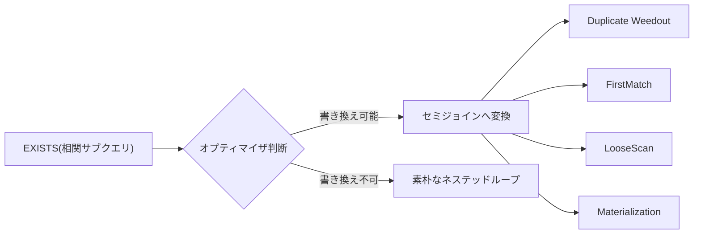

# Basic Syntax 7

## サブクエリ

```sql
SELECT
    AVG(score) AS avgscore
FROM
    exam
GROUP BY
    id
;
```

```sh
+----------+
| avgscore |
+----------+
|  84.5000 |
|  65.5000 |
|  74.0000 |
|  74.5000 |
+----------+
4 rows in set (0.002 sec)
```

---

```sql
SELECT
    MAX(AVG(score)) AS avgscore
FROM
    exam
GROUP BY
    id
;
```

これを実行すると MySQL では `Invalid use of group function` というエラーになります。

理由

- GROUP BY id によって、テーブルは id ごとのグループに分割される
- AVG(score) は各グループに対して1つの値を返す（グループ関数）
- ここに MAX(...) をさらに被せようとすると、「グループ関数の結果に対してもう一段グループ関数をかける」という二重集約になる
- SQLの仕様上、集約関数の引数の中に別の集約関数を書くことは許されていない（ネスト不可）

だから7.mdの例では、まず AVG(score) AS avgscore ... GROUP BY id の結果をサブクエリとして一度テーブル化し、外側のクエリでそのテーブルに対して MAX(avgscore) をかける、という2段階の書き方をしています。
集約→集約をやりたい場合は、間に1回「結果を確定させる層（サブクエリ）」を挟む必要がある、というのがポイントです。

---

```sql
SELECT
    ROUND(MAX(avgscore), 2)
FROM
    (
        SELECT
            AVG(score) AS avgscore
        FROM
            exam
        GROUP BY
            id
    ) AS t
;
```

`AS t` をつけないと `ERROR 1248 (42000): Every derived table must have its own alias` というエラーになる。

```sh
+----------+
| avgscore |
+----------+
|  84.5000 |
+----------+
1 row in set (0.001 sec)
```

### 別の書き方

```sql
SELECT
    ROUND(AVG(score), 2) AS avgscore
FROM
    exam
GROUP BY
    id
ORDER BY
    avgscore DESC
LIMIT 1
;
```

## サブクエリに条件をつける

```sql
SELECT
    AVG(score) AS avgscore
FROM
    exam
;
```

```sh
+----------+
| avgscore |
+----------+
|  74.7143 |
+----------+
1 row in set (0.000 sec)
```

```sql
SELECT
    *
FROM
    exam
WHERE
    score >=
        (
            SELECT
                AVG(score) AS avgscore
            FROM
                exam
        )
;
```

```sh
+----+--------------+-------+
| id | subject      | score |
+----+--------------+-------+
|  1 | PC基礎       |    92 |
|  1 | デザイン     |    77 |
|  2 | デザイン     |    80 |
|  4 | PC基礎       |    85 |
+----+--------------+-------+
4 rows in set (0.001 sec)
```

## 存在有無の確認 `EXISTS`

```SQL
SELECT
    id,
    name
FROM
    student
WHERE
    EXISTS
        (
            SELECT
                *
            FROM
                exam
            WHERE
                exam.id = student.id
        )
ORDER BY
    id
;
```

```sh
+----+---------------+
| id | name          |
+----+---------------+
|  1 | 佐藤 琢磨     |
|  2 | 大塚 愛       |
|  3 | 藤井 隆       |
|  4 | 福原 愛       |
+----+---------------+
4 rows in set (0.005 sec)
```

## 相関副問い合わせ

```SQL
SELECT
    *
FROM
    exam AS t1
WHERE
    score =
        (
            SELECT
                MAX(score)
            FROM
                exam AS t2
            WHERE
                t1.subject = t2.subject
        )
;
```

```sh
+----+--------------+-------+
| id | subject      | score |
+----+--------------+-------+
|  1 | PC基礎       |    92 |
|  2 | デザイン     |    80 |
+----+--------------+-------+
2 rows in set (0.002 sec)
```

## 考察

同じ「相関副問い合わせ」でも、中身の処理は結構違うよ！

- **EXISTS版**→ 「真偽だけ知りたい」から、オプティマイザが**セミジョイン**に書き換えて、早期終了(見つかったら即終わり)できることが多い
- **MAX版**→ 「値の比較」だから書き換えづらくて、素朴にやると外側の行×内側の全件実行になる**ネステッドループ**になりがち

## そもそも「相関副問い合わせ」とは

外側のクエリの行を1行ずつ、内側のサブクエリに"持ち込んで"評価するやつ。

```txt
外側: student の各行
  ├─ id=1 → 内側実行(exam.id=1は存在する?) → true/false
  ├─ id=2 → 内側実行(exam.id=2は存在する?) → true/false
  ├─ id=3 → 内側実行(exam.id=3は存在する?) → true/false
  └─ id=4 → 内側実行(exam.id=4は存在する?) → true/false
```

見た目上は「外側の行数 × 内側のクエリ実行」に見えるけど、これは意味論(セマンティクス)であって、実際の実行計画がこの通りになるとは限らない。

## EXISTS編：内部ではセミジョインに化けてる

MySQLのオプティマイザは「EXISTS + 相関」を見ると、素朴なネステッドループのままにせず、可能なら **semi-join** に書き換える。
理由は「重複除去した存在チェック」って本質的にJOINと同じ意味だから。



| 戦略              | やってること                                                |
| ----------------- | ----------------------------------------------------------- |
| FirstMatch        | 最初の1件が見つかった時点で次の外側行へ(短絡評価っぽい動き) |
| Duplicate Weedout | 一旦普通にJOINしてから重複を後で除去                        |
| LooseScan         | インデックスの並び順を利用してムダなスキャンを飛ばす        |
| Materialization   | サブクエリの結果を一時テーブルにして使い回す                |

`EXPLAIN` で見ると `select_type` が `DEPENDENT SUBQUERY` じゃなくて `SIMPLE` になってたりして、「あれ、JOINになってる」って気づくはず。

```sh
| -> Sort: student.id
    -> Stream results  (cost=3.24 rows=7)
        -> Nested loop inner join (LooseScan)  (cost=3.24 rows=7)
            -> Remove duplicates from input sorted on PRIMARY  (cost=0.786 rows=7)
                -> Covering index scan on exam using PRIMARY  (cost=0.786 rows=7)
            -> Single-row index lookup on student using PRIMARY (id = exam.id)  (cost=1.85 rows=1)
1 row in set, 1 warning (0.003 sec)
```

書いたSQLは「studentを主語に、examの存在をチェックする」形だったよね。
でも実行計画を見ると、内側から外側へ読む(MySQLのツリーは子→親の順で実行)とこうなってる:

```txt
① examテーブルをPRIMARY(id)でカバリングインデックススキャン
    → id列だけ見れば済むから、テーブル本体は読まない(高速)
② 同じidが連続してたら重複除去(1人が複数科目受けてるから id は重複しうる)
③ 重複除去されたユニークなidごとに、studentをPRIMARYキーで1行ルックアップ
```

つまり「student→examを確認する」じゃなくて「exam(重複除去済み)→studentを引く」に処理順序が入れ替わってるの。
なんでこうなるかというと:

- examは7行(小さい)
- studentは主キー(id)を持ってるから、1件ずつの点検索(Single-row index lookup)がめちゃくちゃ安い(cost=1.85でも実質「index一発」)

っていう理由でオプティマイザが「小さい方&重複除去しやすい方を先に回して、デカい/検索コストが安い方を後から刺す」判断をしたってわけ。
LooseScanは「相関キーの重複をインデックスの並びを使ってスキップする」戦略で、まさにexam.idがPRIMARYの先頭(またはPRIMARYそのもの)だからこそ使えてる。

前回言った「FirstMatch/Duplicate Weedout/LooseScan/Materialization のどれかに化ける」って話の、まさにLooseScanが選ばれた実例が見れたってことだね。

## 相関MAX編：こっちは書き換えにくい

値同士の比較(`score = MAX(score)`)だから、EXISTSみたいに「真偽だけ」で終われない。
MAX を出すには**その相関値に対応する全行を見る**必要があるから、早期終了できないのがつらいところ。

```txt
外側: exam の各行(t1)
  ├─ t1.subject="PC基礎"   → 内側実行: MAX(score) WHERE subject="PC基礎"   → 92
  │       → t1.score(92) == 92 ? → 一致 → 採用
  ├─ t1.subject="デザイン" → 内側実行: MAX(score) WHERE subject="デザイン" → 80
  │       → t1.score(80) == 80 ? → 一致 → 採用
  └─ ...(他の行も同様に内側を都度実行)
```

`EXPLAIN` すると `DEPENDENT SUBQUERY` って表示されて、「あ、これ行ごとに評価されてるやつだ」ってわかる。
ただしMySQLには同じ相関値(同じsubject)なら結果をキャッシュして使い回す最適化もあるから、必ずしも毎回フルスキャンってわけじゃない。
とはいえインデックスが `(subject, score)` に無いと、件数が増えたときにキツくなりがち。

```sh
| -> Filter: (t1.score = (select #2))  (cost=0.95 rows=7)
    -> Table scan on t1  (cost=0.95 rows=7)
    -> Select #2 (subquery in condition; dependent)
        -> Aggregate: max(t2.score)  (cost=0.58 rows=1)
            -> Filter: (t1.`subject` = t2.`subject`)  (cost=0.35 rows=1)
                -> Table scan on t2  (cost=0.35 rows=7)
1 row in set, 1 warning (0.001 sec)
```

`(subquery in condition; dependent)` ってラベルが、まさに従来の `EXPLAIN` で言う `DEPENDENT SUBQUERY` の `FORMAT=TREE` 版表記。
読み方はこう:

```txt
t1の行を1件読む(7回ループ)
  └─ そのたびにSelect #2を実行
       └─ t2を毎回フルスキャン(7行)して subject が一致する行だけ集計
       └─ MAX(score) を算出
  └─ t1.score と比較して一致すればFilter通過
```

理屈上は最大 7(外側) × 7(内側) = 49行分の比較処理が走ってる計算。
件数が今は7件だから軽いけど、これが数万行になったら普通にキツい。

> 補足: MySQLには相関値が連続で同じ場合に内側の結果をキャッシュする最適化もあるんだけど、今回のEXPLAINには明示的なキャッシュ表記が出てないから、今回はシンプルに「毎回律儀に実行」されてると見ていいよ。

### 高速化したい時の書き換え案

相関MAXは**派生テーブルJOIN**に書き換えると速いことが多いよ。内側のGROUP BYを1回だけ回して済ませる作戦。

```sql
SELECT
    t1.*
FROM
    exam AS t1
JOIN (
    SELECT
        subject,
        MAX(score) AS max_score
    FROM
        exam
    GROUP BY
        subject
) AS t2
ON
    t1.subject = t2.subject
    AND t1.score = t2.max_score
;
```

ウィンドウ関数(`RANK() OVER (PARTITION BY subject ORDER BY score DESC)`)で書くのもアリ。
どっちも「相関のたびに内側を実行する」構造から脱出できるのが強み。
